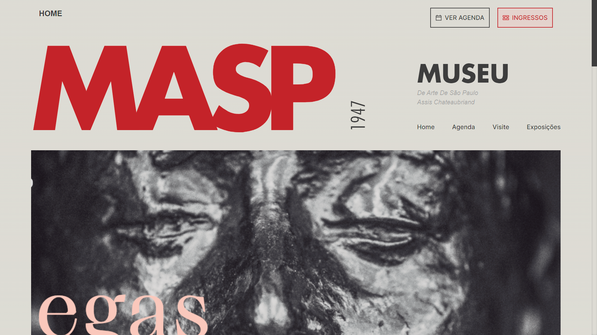

<strong>Link: </strong> <a>https://masp.vercel.app/</a>


</br></br>

# Museu de Arte de São Paulo (MASP)

Este é um projeto front-end para o Museu de Arte de São Paulo (MASP), desenvolvido em Next.js (Typescript) e estilizado com Tailwind CSS.

## Visão Geral

O Museu de Arte de São Paulo, mais conhecido como MASP, é um dos mais importantes museus de arte do Brasil e da América Latina. Este projeto visa ser uma releitura do site oficial do <a target="_blank" href="https://masp.org.br">MASP</a>, fornecendo informações sobre suas exposições, acervo, história e eventos.

## Principais Tecnologias Utilizadas

- [Next.js](https://nextjs.org/): Framework React para criação de aplicações web.
- [Typescript](https://www.typescriptlang.org/): Linguagem de programação digitada baseada em JavaScript, oferecendo melhores ferramentas em qualquer escala.
- [Tailwind CSS](https://tailwindcss.com/): Framework CSS utilitário para estilização rápida e consistente.

## Instalação e Uso

1. Clone este repositório:

   ```bash
   git clone https://github.com/ryan-mf-eloy/Masp.git
2. Execute o comando a seguir dentro da pasta do projeto clonado:

   ```bash
   npm run dev
